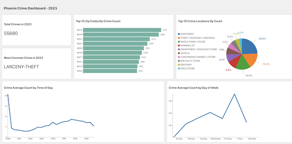

# Phoenix Crime Dashboard

This is a React application with a Flask backend that displays crime data for Phoenix in the year 2023. The 
data is visualized in various ways, including total crimes, most common crime, crimes by zip code, crime 
trends over time, crimes by location type, crimes by day or time, and crimes by day of the week.

## Setup

1. Clone the repository: `git clone https://github.com/yourusername/phoenix-crime-dashboard.git`
2. Navigate to the project directory: `cd phoenix-crime-dashboard`
3. Install the dependencies: `npm install`
4. Start the application: `npm start`

## Backend Setup

1. Navigate to the backend directory: `cd backend`
2. Install the dependencies: `pip install -r requirements.txt`
3. Run the application: `flask run`

## Components

- `BarChart`: Renders a bar chart.
- `TotalCrimes`: Displays the total number of crimes.
- `MostCommonCrime`: Displays the most common crime.
- `CrimesByZipCode`: Displays crimes by zip code.
- `CrimeTrendsOverTime`: Displays crime trends over time.
- `CrimeByLocationType`: Displays crimes by location type.
- `CrimeByDayOrTime`: Displays crimes by day or time.
- `CrimeByDayOfWeek`: Displays crimes by day of the week.

## License

This project is licensed under the terms of the MIT license.
